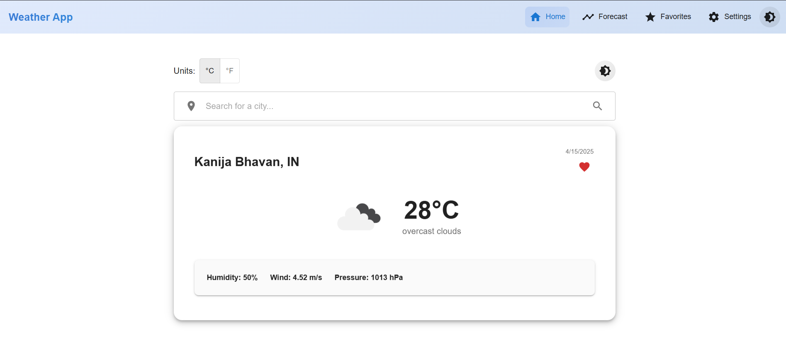
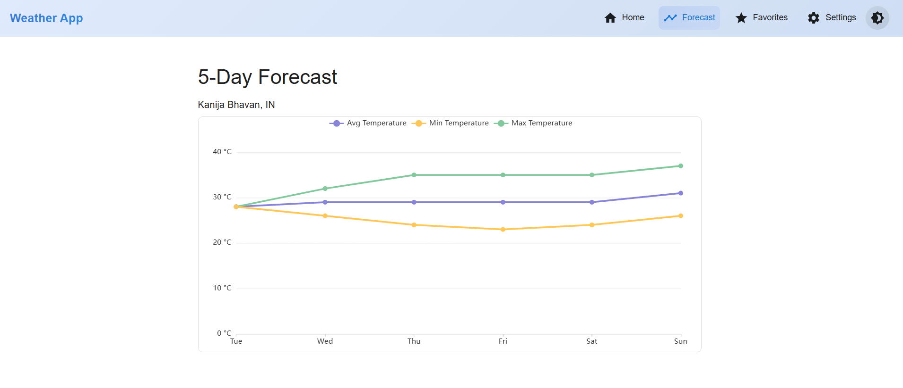
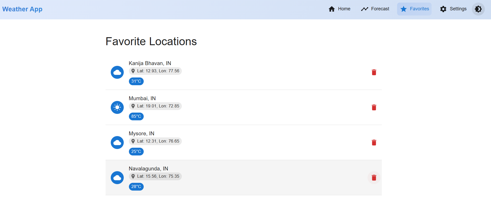

# 🌦️ ClimaVue - Modern Weather Dashboard

# live link 


A sleek, responsive weather application built with React & Material-UI that delivers real-time weather data and forecasts with beautiful visualizations.

 <!-- Replace with actual screenshot -->

## ✨ Features

- 🌤️ **Current Weather** - Real-time temperature, humidity, wind speed, and pressure
- 📊 **5-Day Forecast** - Interactive charts with temperature trends
- 🌗 **Dark/Light Mode** - Theme-adaptive UI with smooth transitions
- ❤️ **Favorites System** - Save locations with local storage
- ⚡ **Optimized Performance** - React Query caching and memoization
- 📱 **Fully Responsive** - Works on all device sizes

## 🚀 Getting Started

### Prerequisites
- Node.js (v16+)
- npm or yarn

### Installation
1. Clone the repository
   ```bash
   git clone https://github.com/yourusername/ClimaVue.git
   cd ClimaVue
Install dependencies

bash
Copy
npm install
Create .env file

env
Copy
VITE_APP_WEATHER_API_KEY=your_openweathermap_key
Start development server

bash
Copy
npm run dev
🏗️ Project Structure
Copy
src/
├── api/                  # API services
│   ├── weatherAPI.js     # OpenWeatherMap integration
│   └── cache.js          # Response caching
├── components/           # Reusable UI
│   ├── WeatherCard.jsx   # Current weather display
│   ├── ForecastChart.jsx # ECharts visualization
│   └── ...               
├── contexts/             # State management
│   ├── WeatherContext.js 
│   └── ThemeContext.js   
├── pages/                # Application views
│   ├── Home.jsx          
│   ├── Forecast.jsx      
│   └── ...               
└── assets/               # Static resources
📦 Dependencies
Package	Usage
@mui/material	UI Components
@mui/icons-material	Icons
echarts-for-react	Data Visualization
react-query	API State Management
axios	HTTP Client
🎨 Theming
The app supports dynamic theme switching between light and dark modes:

jsx
Copy
const theme = createTheme({
  palette: {
    mode: 'dark', // or 'light'
    primary: {
      main: '#3f51b5',
    },
  },
});
⚡ Performance Optimizations
Code Splitting with React.lazy()

API Caching (15-minute stale time)

Memoized Components with React.memo

Debounced Search input

🐛 Debugging Tips
Check browser console for errors

Verify API keys are loaded:


js
Copy
console.log(import.meta.env.VITE_APP_WEATHER_API_KEY);
Use React DevTools for state inspection
## 📸 screenshots




📜 License
MIT © 2025 prabhanjan👨🏻‍💻

